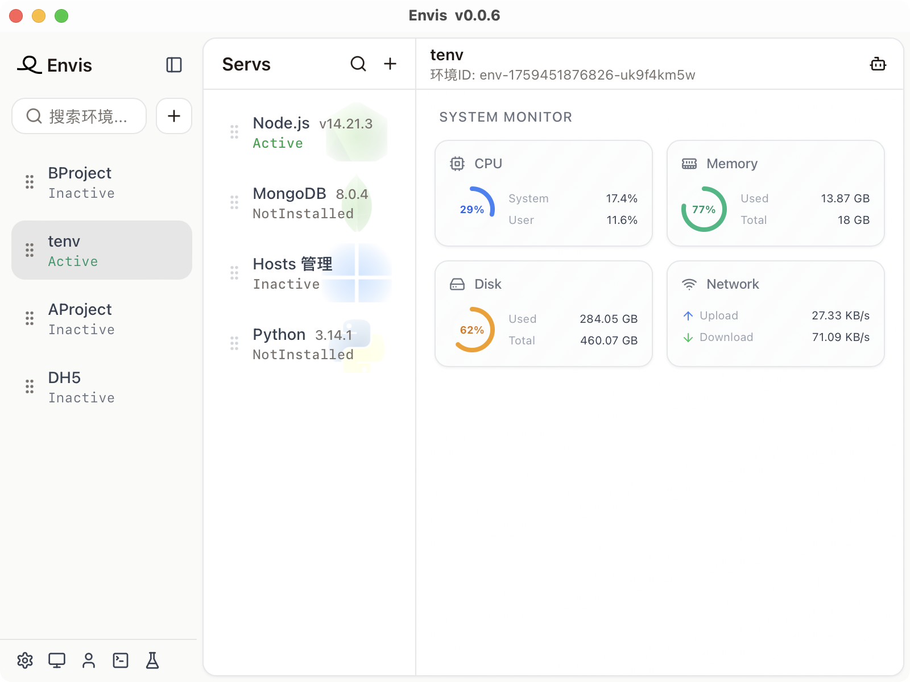

# Envis

<p align="center">
  
</p>

<p align="center">
  <strong>A modern cross-platform environment and service management tool</strong>
</p>

<p align="center">
  [中文文档](./README.zh-CN.md) | English
</p>

## 📸 Screenshot

<p align="center">
  
</p>

## ✨ Features

- 🖥️ **System Monitoring** - Real-time system resource monitoring
- 🌍 **Environment Management** - Manage multiple environments and configurations
- 🚀 **Service Management** - Easy service deployment and monitoring
- 🤖 **AI Integration** - Built-in AI assistant panel
- 📝 **Log Management** - Centralized logging and viewing
- 🎨 **Modern UI** - Beautiful interface built with Radix UI and Tailwind CSS
- 🌐 **i18n Support** - Multi-language support

## 🛠️ Tech Stack

- **Frontend**: React 18 + TypeScript + Vite
- **Desktop**: Tauri 2
- **UI Components**: Radix UI + Tailwind CSS
- **State Management**: Jotai
- **Build Tool**: Vite

## 📦 Installation

### Prerequisites

- Node.js 18+
- pnpm (recommended) or npm
- Rust (for Tauri development)

### Setup

```bash
# Clone the repository
git clone <your-repo-url>
cd envis-app

# Install dependencies
pnpm install

# Start development server
pnpm dev:pc
```

## 🚀 Development

```bash
# Run in development mode
pnpm dev:pc

# Build for production
pnpm pack

# Preview production build
pnpm preview
```

## 📝 Scripts

- `pnpm dev` - Start Vite development server
- `pnpm dev:pc` - Start Tauri development mode
- `pnpm build` - Build the application
- `pnpm pack` - Package the application
- `pnpm publish` - Release a new version

## 🤝 Contributing

Contributions are welcome! Please feel free to submit a Pull Request.

## 📄 License

This project is licensed under the MIT License.

## 👥 Authors

- Your Name

---

Made with ❤️ using Tauri and React
